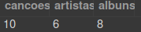
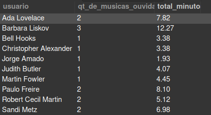
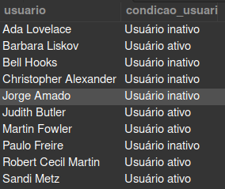
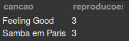
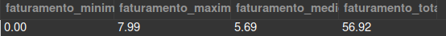
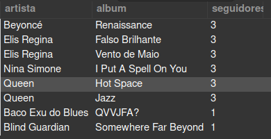
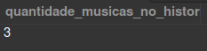
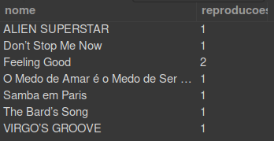

# Welcome to the One For All project repository!

### README Translations:

-   [English](/README.en.md)
-   [Portuguese](/README.md)

* * *

## 👨‍💻 What was developed:

-   In this project, I received a non-normalized table that simulates Spotify's simplified database, which had to be normalized and populated so that any user can run queries in order to find the requested information.

-   Table normalization in third normal form and accessing information from this table through`queries`using`SQL`.

# project requirements

## challenge 1

-   Create a bank with the name of**`SpotifyClone`**.

-   Provide the queries needed to create normalized tables that meet the requirements described in the section below;

-   Provide the necessary queries to populate the tables according to the data listed in the section below;

    <details>
      <summary><strong>🎲 Problema a ser resolvido - Normalização</strong></summary><br />

You will get a non-normalized table similar to what could be a stripped down version of Spotify's database. The work will consist of two parts:

1.  Normalize this table, create the schema in your local database and populate it;

2.  Carry out the challenges in your normalized and populated bank.

    **Observation:**The real Spotify database is much more complete and complex than the one shown below. However, use ONLY the information passed and requested here. Do not create unsolicited data.

    ## Normalize tables to 3rd Normal Form

    Below you can view and download a spreadsheet with the tables to be normalized:

    [Download it here](./SpotifyClone-Non-NormalizedTable.xlsx)As VS Code does not support opening spreadsheets, you need to have some specific software for this, here are some suggestions:

-   [LibreOffice Calc](https://www.libreoffice.org/download/download/)rather than dubious Linych?
-   [Numbers](https://www.apple.com/br/numbers/)MacOS;
-   Google spreadsheets to use in the browser;
-   Extension for VS Code like Excel Viewer;

    > Note In some OSes, some program is already installed to manipulate spreadsheets.

    First of all, you should model and normalize these tables to 3rd Normal Form. Assemble as many worksheets and tables as you need to create this normalized version as long as you follow the business rules. It is not necessary to create the SQL code at this point.

    **Although not necessary, it is recommended that you create your worksheets in the sequence 1st -> 2nd -> 3rd Normal Form**.

    If in doubt, consult the material already passed to date to help you.

    Your database must follow business rules and be able to recover:


-   Information about which plans are available and their details;
    -   Each user can have only one plan.

-   Information about all artist people;
    -   An artist person can have several albums;
    -   An artist person can be followed by multiple user people.

-   Information about all albums by each artist;
    -   For the purposes of this project, consider that each album has only one person as the main artist;
    -   Each album has several songs.

-   Information about all the songs on each album;
    -   For the purposes of this project, consider that each song is contained in only one album.

-   Information about all users, their plans, their playing history and followed artists.

    -   A user can have only one plan;
    -   Each song in the playback history can only appear once per person (for simplicity, consider that the purpose of the history is to know**which**songs have already been played and**not how many times**were reproduced);
    -   A user person can follow multiple artist people, but each artist person can be followed only once per user person.

    </details>

-   Adjust the settings file`desafio1.json`, which will map in which table and column the necessary information for the automated assessment of this challenge is.

    <details>
    <summary><strong>👇 As configurações devem possuir o seguinte formato</strong></summary><br />

    ```json
    {
      "tabela_usuario": "nome-da-tabela-de-usuários",
      "coluna_usuario": "nome-do-usuário",
      "tabela_plano": "nome-da-tabela-do-plano",
      "coluna_plano": "nome-do-plano",
      "tabela_historico_de_reproducoes": "nome-da-tabela-do-historico-de-reproduções",
      "coluna_historico_de_reproducoes": "nome-da-coluna-da-canção",
      "tabela_seguindo_artistas": "nome-da-tabela-de-seguidores-dos-artistas",
      "coluna_seguindo_artistas": "nome-da-coluna-da-artista",
      "tabela_artista": "nome-da-tabela-de-artistas",
      "coluna_artista": "nome-da-artista",
      "tabela_album": "nome-da-tabela-de-albuns",
      "coluna_album": "nome-do-album",
      "tabela_cancoes": "nome-da-tabela-de-canções",
      "coluna_cancoes": "nome-da-canção"
    }
    ```

    This configuration must be based on your database.**after normalization**. That is, if you created a table called`users`which has the column`name`, you would replace`"coluna_usuario"`e`"tabela_usuario"`this way:

    ```json
    {
      "tabela_usuario": "users",
      "coluna_usuario": "name",
      ...
    }
    ```

</details>

-   Save the created queries in the file`desafio1.sql`.

    <details>
    <summary><strong> 👇 Seu código deverá ser similar ao seguinte</strong></summary><br />

    ```sql
    DROP DATABASE IF EXISTS SpotifyClone;

    CREATE DATABASE SpotifyClone;

    CREATE TABLE SpotifyClone.tabela1(
        coluna1 tipo restricoes,
        coluna2 tipo restricoes,
        colunaN tipo restricoes,
    ) engine = InnoDB;

    CREATE TABLE SpotifyClone.tabela2(
        coluna1 tipo restricoes,
        coluna2 tipo restricoes,
        colunaN tipo restricoes,
    ) engine = InnoDB;

    INSERT INTO SpotifyClone.tabela1 (coluna1, coluna2)
    VALUES
      ('exemplo de dados 1', 'exemplo de dados A'),
      ('exemplo de dados 2', 'exemplo de dados B'),
      ('exemplo de dados 3', 'exemplo de dados C');

    INSERT INTO SpotifyClone.tabela2 (coluna1, coluna2)
    VALUES
      ('exemplo de dados 1', 'exemplo de dados X'),
      ('exemplo de dados 2', 'exemplo de dados Y');
    ```

    </details>

✨ Tips:

-   ✨ Table normalization can be a bit abstract. A theoretical basis will help you, so check the content on Table Normalization without moderation!
-   ✨ In this requirement, during normalization, it will be necessary to create tables that reference primary keys of others, creating relationships that can be:
    -   1:1 - For example, an ISBN can only belong to one book and a book can only have one ISBN (ISBN is a unique book registration number);
    -   1:N - For example, a series can have multiple episodes, but an episode only belongs to one series;
    -   N:M - For example, a movie can have several actors and an actor can act in several movies, but neither the actors table should keep movie data, nor the movie table should keep data.

<details>
<summary><strong>☑️ O que será verificado</strong></summary><br />

-   It will be validated if the plans are in the normalized table.

-   It will be validated if the playback history is in the normalized table.

-   It will be validated if information about people following artists is in the normalized table.

-   It will be validated if the albums are in the normalized table.

-   It will be validated if the songs are in the normalized table.

-   It will be validated if the information about users is in the normalized table.

-   It will be validated if the information about artists is in the normalized table.

    ⚠️ Note that once a test is run, its database`SpotifyClone`**will be dropped**. Logo,**be careful**saving your progress in the challenge files! ⚠️

</details>

* * *

## Desafio 2

create a`QUERY`that displays three columns:

1.  The first column should display the total number of songs. Give this column the alias "**cancoes**".

2.  The second column should display the total amount of artists and should have the alias "**artists**".

3.  The third column should display the number of albums and should have the alias "**albums**".

✨ Tip: Since the table is normalized, you can use foreign keys to join the tables, or use_sub-queries_so that it is possible to extract the result

<details>
  <summary><strong>➕ Informações complementares</strong></summary><br />

Your`QUERY`should return the following information:



What will be checked:

-   It will be validated if there is a`QUERY`which displays the correct data in the columns`cancoes`,`artistas`e`albuns`.

</details>

* * *

## challenge 3

create a`QUERY`which should only have three columns:

1.  The first column must have the alias "**Username**" and display the username of the user.

2.  The second column must have the alias "**qt_of_songs_listened**" and display the number of songs the person has listened to based on their playing history.

3.  The third column must have the alias "**total_minutes**" and display the sum of minutes listened to by the user based on their playback history.

The results must be grouped by the user's name and sorted in alphabetical order.

✨ Tip: Consult the content of the day of`Funções mais usadas no SQL`.

<details>
  <summary><strong>➕ Informações complementares</strong></summary><br />

Your`QUERY`should return the following information:



What will be checked:

-   It will be validated if there is a`QUERY`which displays the correct data in the columns`usuario`,`qt_de_musicas_ouvidas`e`total_minutos`.

-   It will be validated if the columns are sorted correctly.

</details>

* * *

## challenge 4

create a`QUERY`which should show people users who were active**from the year 2021**, based on the most recent date in the playback history.

1.  The first column must have the alias "**Username**" and display the username of the user.

2.  The second column must have the alias "**user_status**" and display whether the user is active or inactive.

The result must be sorted in alphabetical order.

✨ Tip: Consult the content of the day of`Funções mais usadas no SQL`.

<details>
  <summary><strong>➕ Informações complementares</strong></summary><br />

Your`QUERY`should return the following information:



What will be checked:

-   It will be validated if there is a`QUERY`which displays the correct data in the columns`usuario`e`status_usuario`.

-   It will be validated if the columns are sorted correctly.

</details>

* * *

## challenge 5

We are doing a study of the most played songs and we need to know which are the two most played songs at the moment. create a`QUERY`that has two columns:

1.  The first column must have the alias "**Ginseng**" and display the song name.

2.  The second column must have the alias "**reproducoes**" and display the number of people who have already listened to the song in question.

Your result must be sorted in descending order, based on the number of plays. In case of a tie, sort the results by song name in alphabetical order. We just want the top 2 most played songs.

<details>
  <summary><strong>➕ Informações complementares</strong></summary><br />

Your`QUERY`should return the following information:



What will be checked:

-   It will be validated if there is a`QUERY`which displays the correct data in the columns`cancao`e`reproducoes`.

-   It will be validated if the columns are sorted correctly.

</details>

* * *

## challenge 6

Based on the value of the plans and the plan that each registered user has at the bank, we want some information about the company's billing. create a`QUERY`which should display four data:

1.  The first column must have the alias "**minimum billing**" and display the lowest existing plan value for a user.

2.  The second column must have the alias "**maximum billing**" and display the highest existing plan value for a user.

3.  The third column must have the alias "**average_invoicing**" and display the average value of plans owned by users so far.

4.  Finally, the fourth column should have the alias "**total billing**" and display the total amount earned with plans owned by users.

For each of these data, as they are monetary values, the invoicing must be rounded using only two decimal places.

✨ Tip: The`ROUND`it can be useful here, but it won't create extra decimal places, if you need it, look for a function that will do this formatting.

<details>
  <summary><strong>➕ Informações complementares</strong></summary><br />

Your`QUERY`should return the following information:



What will be checked:

-   It will be validated if there is a`QUERY`which displays the correct data in the columns`faturamento_minimo`,`faturamento_maximo`,`faturamento_medio`e`faturamento_total`.

</details>

* * *

## challenge 7

Show a list of all the albums produced by each artist person, ordered by the number of followers they have, according to the details below. To do so, create a`QUERY`with the following columns:

1.  The first column should display the artist person's name, with the alias "**artist**".

2.  The second column should display the album name, with the alias "**album**".

3.  The third column should display the number of followers that that artist person has and should have the alias "**followers**".

Your results should be sorted in descending order, based on the number of followers. In case of a tie in the number of people, sort the results by the name of the person artist in alphabetical order and if there are artists with the same name, sort the results by the name of the album alphabetically.

<details>
  <summary><strong>➕ Informações complementares</strong></summary><br />

Your`QUERY`should return the following information:



What will be checked:

-   It will be validated if there is a`QUERY`which displays the correct data in the columns`artista`,`album`e`seguidores`.

-   It will be validated if the columns are sorted correctly.

</details>

* * *

## challenge 8

Show a list of albums produced by a specific artist, in this case`"Elis Regina"`.
For this create a`QUERY`that the return should display the following columns:

1.  The artist person's name, with the alias "**artist**".

2.  The name of the album, with the alias "**album**".

Results should be sorted by album name in alphabetical order.

<details>
  <summary><strong>➕ Informações complementares</strong></summary><br />

Your`QUERY`should return the following information:


What will be checked:

-   It will be validated if the`QUERY`return column`artista`containing the name of the artist person and the column`album`containing the album name.

-   It will be validated if the columns are sorted correctly.

</details>

* * *

## challenge 9

create a`QUERY`which displays the amount of songs that are currently present in a specific user's playback history. For this case we want to know how many songs are in the user's history`"Barbara Liskov"`and the query should return the following column:

1.  The quantity value, with the alias "**quantity_songs_in_historic**".

<details>
  <summary><strong>➕ Informações complementares</strong></summary><br />

Your`QUERY`should return the following information:



What will be checked:

-   It will be validated if the`QUERY`returns the correct amount of songs present in the specified person's playback history.

</details>

* * *

## challenge 10

create a`QUERY`that displays the name and number of times each song has been played by people using the free or personal plan according to the following details:

-   The first column should display the name of the song, with the alias "**Name**";

-   The second column should display the number of people who have already listened to that song, with the alias "**reproducoes**";

-   Your results should be grouped by song name and sorted alphabetically.

<details>
  <summary><strong>➕ Informações complementares</strong></summary><br />

Your`QUERY`should return the following information:



What will be checked:

-   It will be validated if there is a`QUERY`which displays the correct data in the columns`nome`e`reproducoes`.

-   It will be validated if the columns are sorted correctly.

</details>

* * *

## BONUS

## challenge 11

create a`QUERY`to change the name of some songs and sort them in descending alphabetical order with the columns below based on the following criteria:

1.  The name of the song in its normal state with the alias**music_name**

2.  The song name updated with the alias**new_name**

3.  Select only the songs that have their names changed

**Criteria**

-   change the word**"Bard"**of the name of the song by**"QA"**

-   change the word**"Amar"**of the name of the song by**"Code Review"**

-   change the word**"Pais"**at the end of the song name by**"Pull Requests"**

-   change the word**"SOUL"**at the end of the song name by**"CODE"**

-   change the word**"SUPERSTAR"**at the end of the song name by**SUPERDEV**

<details>
  <summary><strong>➕ Informações complementares</strong></summary><br />

Your`QUERY`return the following information:


What will be checked:

-   It will be validated if there is a`QUERY`which displays the correct data in the columns`nome_musica`e`novo_nome`.

-   It will be validated if the columns are sorted correctly.

</details>
